  <a href="https://eduarddragu.dev">
    <picture>
      <source media="(prefers-color-scheme: dark)" srcset="assets/header-dark.svg">
      
    </picture>
  </a>

Platform engineer at **UniCredit**, in Milan. Seven years of cloud infrastructure across GCP and Azure, and before that, real data centers: vSphere clusters, racks, patching eight thousand machines at a time. Still a bare-metal lover passing as a cloud engineer.

#### Now

- Keeping 200+ applications alive on GKE, with a bill that still makes sense
- Building [(Another) Habit Tracker](https://github.com/eduarddragu/another-habit-tracker): an offline Android app that picks what I study, nags until it's done and blocks my doomscrolling
- Training for the next race, and keeping the vibes up!

 

  <a href="https://eduarddragu.dev">
    <picture>
      <source media="(prefers-color-scheme: dark)" srcset="assets/off-call-dark.svg">
      
    </picture>
  </a>

  <a href="https://eduarddragu.dev"><picture><source media="(prefers-color-scheme: dark)" srcset="assets/button-site-dark.svg"></picture></a>
  <a href="https://eduarddragu.dev/resume/"><picture><source media="(prefers-color-scheme: dark)" srcset="assets/button-resume-dark.svg"></picture></a>
  <a href="https://eduarddragu.dev/projects/"><picture><source media="(prefers-color-scheme: dark)" srcset="assets/button-projects-dark.svg"></picture></a>

or write to <a href="mailto:me@eduarddragu.dev">me@eduarddragu.dev</a>

